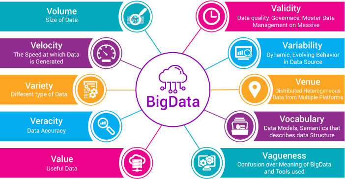

```{r setup, include=FALSE,message=FALSE}
options(htmltools.dir.version = FALSE,warn = FALSE,warning=FALSE)
options("getSymbols.warning4.0"=FALSE)
Sys.setenv(TZ = "GMT")
library(tidyverse)
library(sparklyr)
```

# Afinal, o que é **Big Data?**

<br/>
<br/>
.center[]
.

---
# 5 V's
<br/>
<br/>
.center[]


---
# 6 V's
<br/>
.center[]


---
# 8 V's

```{r out.height=520, echo=FALSE}
knitr::include_graphics(path = "8_vs_big_data.png")
```

---
# 10 V's

<br/>
<br/>
.center[]


---

#Big Data
- ###" Dados ou processos que requerem um processamento distribuído não convencional"
`r tufte::quote_footer('--- Aaron Richter')`

<br/>

- Ou seja, a considerando uma mesma base de dados, esta pode ser tratada como "big data" or "small data" a depender do que iremos fazer com ela

---
class: inverse, center, middle

# Evolução dos dados

---

# Text Mining?
```{r  out.height=520, echo=FALSE}
knitr::include_graphics(path = "first_text_mining.jpg")
```

---

# Armazenamento de Informação
```{r  echo=FALSE}
knitr::include_graphics(path = "world-store-capacity-resized.png")
```


---
# Google File System (GFS)

Em 2003, a Google publica um artigo que mostra como eles lidavam com grande volume de dados
dividindo a informação entre diversos arquivos e armazendo-os através de diversas máquinas.

.center[]


---
# Map Reduce .small[(Dean and Ghemawat, 2004)] 

Em 2004, Dean and Ghemawat, publicam um paper apresentando o Map Reduce, uma forma de processar e manipular os dados prsentes do GFS

  - **Map** uma maneira de transformar cada arquivo em novos arquivos
  - **Reduce** combina os resultados gerados durante a fase de map

.center[]

---
# MapReduce
```{r  out.height=480, echo=FALSE}
knitr::include_graphics(path = "map_reduce_howto.png")
```
---
# MapReduce
```{r  out.height=520, echo=FALSE}
knitr::include_graphics(path = "sandwich-mapreduce.jpg")
```
---
#Hadoop

Após a publicação destes papers, uma equipe do *Yahoo* começou a trabalhar para a implementação do GFS e MapReduce como sendo um projeto único e open source.

Este projeto que posteriormente viria a ser conhecido como o **Hadoop File System** (HFDS)

.center[]

---
background-image: url(http://spark.apache.org/images/spark-logo-trademark.png)
background-size: 100px
background-position: 90% 8%

# Spark

- UC Berkeley's AMP Lab .small[(2009)]

- Otimização do carregamento e processamentos dos dados utilizando operações em disco e em memória

- Desenvolvido em Scala

<br/>

.center[*"Apache Spark é um* ***dispositivo*** ***analítico*** ***unificado*** *para o processamento de dados em* ***larga escala***"]

.center[<a href="http://spark.apache.org/"> *apache.org*</a>]

<br/>

- APIs for para, Java, Python, **R**, SQL

- Spark serve para o  ***processmento*** de daods, não de ***armazenamento*** 

- Redução significativa em relação aos *bugs* quando comparado ao Hadoop

---
#Spark


.center[]


---
#RIP MapReduce

.center[]

---
background-image: url(https://spark.rstudio.com/thumbs/sparklyr-hex.png)
background-size: 100px
background-position: 90% 8%

#Sparklyr 

- É uma interface do ***Apache Spark*** no R

- Além disso, o Sparklyr, diferente do **Spark R** um back-end em *dplyr* para o Spark

--
```{r fig.align='center',out.height=420,out.width=600, echo=FALSE}
knitr::include_graphics(path = "https://spark.rstudio.com/tools/readme/sparklyr-v2.png")
```

---
class: inverse, center, middle

# Quando não usar sparklyr?

---
# Devo usar SparklyR?

- .big[**P**]: Consigo lidar com a base de dados na minha máquina?
--

- .big[**R**]: Sim.

--
```{r fig.align='center',out.height=420,out.width=420, echo=FALSE}
knitr::include_graphics(path = "not-spark-01.png")
```
---
# Devo usar SparklyR?

- .big[**P**]: Consigo lidar com a base de dados na minha máquina?
--

- .big[**R**]: **Não**.

--
```{r eval=FALSE}
#Instalando o pacote
install.packages("sparklyr")

#Carregando o pacote
library(sparklyr)

#Instalar a versão 2.3 
spark_install(version = "2.3")


```
---
class: inverse, center, middle

# Primeiros Passos

---
# Inicializando os Dados

Uma vez com o Spark instalado, conecta-se:

```{r, warning=FALSE}
#Configurando os parâmetros da conexão do Spark
conf <- spark_config()
#Definindo nº de cores
conf$`sparklyr.cores.local` <- 4
#Memória que será utilizada
conf$`sparklyr.shell.driver-memory` <- "8G"
sc<-spark_connect(master = 'local',version = '2.3',config = conf)
#Copiando o data.frame iris para ambiente spark
iris_spark<-copy_to(sc,iris)

iris_spark
```


---
#Interface Web

- O que está ocorrendo no Ambiente Spark?

```{r,warning=FALSE}
#Para verificar o ambiente spark
spark_web(sc)
```
 
- Fechando a conexão

```{r eval=FALSE}
spark_disconnect(sc)
```

- Classe "Iris_Spark"
```{r}
iris_spark %>% class
```
---
class: inverse, center, middle

# Importando os dados

---
# Data Lakes e diversidades de dados

.center[]

---
# Dados eleitorais

.center[]

.center[http://dontpad.com/ledate_big_data]

---
# Lendo os dados
```{r ,message=FALSE,warning=FALSE}
library(sparklyr)
sc <- spark_connect(master = "local", version = "2.3")

#Votação dos candidatos de 2016
votacao_candidatos_2016<-spark_read_csv(sc,
                                        path = "D:/my_computer/Est_ML_2019/eleicoes_2016/votacao_candidato_2016",
                                        memory = FALSE,
                                        charset = 'latin1',
                                        delimiter = ";")

#Base de dados discricionário dos candidatos de 2016
candidatos_2016<-spark_read_csv(sc,
                                path='D:/my_computer/Est_ML_2019/eleicoes_2016/cand_2016',
                                memory = FALSE,
                                charset = 'latin1',
                                delimiter = ';')

```


---
#Schema

```{r message=FALSE,warning=FALSE}
#Definindo as variáveis (Schema)
toy_example<-data.frame(x=rep(1:5,10^6),y=rep(letters[1:5],10^6))
write.csv(toy_example,file='toy_example.csv',row.names = FALSE)
especificacao_colunas<-c(x='character',y='character')

#Example:
toy_data<-spark_read_csv(sc,path="toy_example.csv",columns = especificacao_colunas)
toy_data %>% head(3)
toy_data<-spark_read_csv(sc,path="toy_example.csv",overwrite = TRUE)
toy_data %>% head(3)
```
---
#Write
```{r, echo=FALSE}

write_data<-data.frame(Format=c("Comma Separated Values","JavaScript Object Notation (JSON)","Library for Support Vector Machines (LIBSVM) ","Optimized Row Columnar (ORC) ","Apache Parquet","Text"),Read=c("spark_read_csv()","spark_read_json()","spark_read_libsvm()","spark_read_orc()","spark_read_parquet()","spark_read_text()"),Write=c("spark_write_csv()","spark_write_json()","spark_write_libsvm()","spark_write_orc()","spark_write_parquet()","spark_write_text()"))
```

```{r,echo=FALSE}
knitr::kable(head(write_data),format='html')
```

---
class: inverse, center, middle

# Análise Exploratória

---
# Tranformar e Visualizar

.center[]

---
# Tidyverse (Hadleyverse)

.center[]
---
background-image: url(https://ih1.redbubble.net/image.543344990.1730/flat,800x800,070,f.jpg)
background-size: 100px
background-position: 90% 8%

# Magrittr

- O pacote *magrittr* permite a utilização do operador *pipe* que funciona como uma ferramenta de modo que é possível manter uma melhor legibilidade e reproducibilidade do código em R

- A principal premissa é que *"x %>% f"* é igual à $f(x)$

Para exemplificar a diferença leia-se os dois blocos de código
```{r}
#Sem a utlização do pipe
mean(sort(iris$Sepal.Length)[1:5])
```


```{r}
#Com a utilização do pipe
iris$Sepal.Length %>% sort %>% .[1:5] %>% mean 
```


---
background-image: url(https://github.com/rstudio/hex-stickers/blob/master/PNG/dplyr.png?raw=true)
background-size: 100px
background-position: 90% 8%

#Dplyr

```{r warning=FALSE,message=FALSE}
library(dplyr)
dplyr_example<-iris %>% 
               filter(Sepal.Length>5) %>% 
               mutate(Sepal_Ratio=Sepal.Length/Sepal.Width) %>% 
               select(Sepal_Ratio,Species) %>% 
               group_by(Species) %>% 
               summarise(Sepal_Ratio_Mean=mean(Sepal_Ratio)) %>% 
               arrange(Sepal_Ratio_Mean)
```

---
background-image: url(https://ih0.redbubble.net/image.543334423.1461/ap,550x550,12x16,1,transparent,t.png)
background-size: 100px
background-position: 90% 4%

#GGplot2

.center[]

---
# Comunicação R e Spark

.center[]


---
# Comunicação R e Spark

.center[]


---
# Spark DataFrame

```{r}
head(candidatos_2016,n = 3)
```
---
#Spark DataFrame
```{r}
#Tentando recuperar o número de linhas
#apenas através do nrow
nrow(candidatos_2016)
```

```{r}
#Recuperando o número de linhas
#utilizando uma função adequada
sdf_nrow(candidatos_2016)
```

- Funções "sdf_" 

---
#Exemplo

Coletando os 5 vereadores mais votados em Salvador
```{r,warning=FALSE,message=FALSE}
votacao_candidatos_2016 %>% 
  filter(NM_MUNICIPIO=="SALVADOR" & DS_CARGO=="Vereador") %>% #Filtrando observações como Veradores de Salvador
  group_by(NM_URNA_CANDIDATO) %>% #Agrupando o conjunto de dados considerando o nome
  summarise(votos_total=sum(QT_VOTOS_NOMINAIS,na.rm = TRUE)) %>% #Somando a quantidade total de votos de cada 
  arrange(desc(votos_total)) %>% #Ordenando em ordem decrescente
  head(n=5) #selecionando apenas as 5 primerias linhas
```

---
# GGPlot and DBplot

.center[]

---
# Example: Bar Plot por gênero
Como exmplo de visualização iremos coletar a frequência de candidatos por gênero,
plotando diretamento do sparklyr primeiramente
```{r out.height=300,out.width=300 ,message=FALSE,warning=FALSE}
library(ggplot2)
candidatos_2016 %>% 
  select(DS_GENERO) %>% #Selecionando a coluna de genero
  ggplot()+
    geom_bar(mapping = aes(DS_GENERO))+theme_bw() #Plotando em relação à quantidade pr gênero
```

---
# Example: Bar Plot por gênero

Agora, utilizaremos o *framework* mais adequado, em que se mapeará as coordenadas do plot,
retornando essa informação para o ambiente R
```{r  out.height=300,out.width=350 ,message=FALSE,warning=FALSE}
library(ggplot2)
candidatos_2016 %>% 
  dplyr::group_by(DS_GENERO) %>% #Agrupando por gênero
  tally() %>% #Considerando o gênero, qauntos aparecem em cada gênero
  collect() %>% #Coleta essa informação do ambiente spark para o R
  ggplot()+
  geom_col(mapping = aes(x = DS_GENERO,y = n))+theme_bw()
```
---
#DBPlot

```{r out.height=350,out.width=350 ,message=FALSE,warning=FALSE}
library(dbplot)
candidatos_2016 %>% 
    filter(!is.na(SG_PARTIDO)) %>% #Filtrando as linhas em que a SG_PARTIDO é NA
    dbplot_bar(SG_PARTIDO)+
labs(title = "Candidatos de cada partido",subtitle = "Histograma")+
theme_bw()+theme(axis.text.x = element_text(angle=90))
```

---
background-image: url(code_time.gif)
background-size: cover
class: center, middle, inverse

#Hora da Prática!

---
#Prática:

Utilizando o sparklyr obtenha as seguintes análises:

1. As dez principais ocupações dos candidatos políticos

1. Faça um plot dos 10 candidatos veradores mais votados do Brasil

1. Um plot que mostre a proporção entre candidatos pretos e brancos eleitos em cada estado

1. Plote um gráfico de colunas, com a quantidade de votos, dos 5 candidatos negros mais votados em Salvador, e os 5 candidatos brancos mais votados em Salvador. .small[Dica: Utilize o innner_join] 


---
#1: 10 Principais Ocupações

```{r eval=FALSE,warning=FALSE}
candidatos_2016 %>% 
  group_by(DS_OCUPACAO) %>% #Agrupando por ocupação
  tally(sort=TRUE) %>% #O Tally conta a ocorrência de cada uma das ocupações
                       #(argumento "sort" já ordena)
  head(n=11) #Escolhe o top 11
```

```{r echo=FALSE,warning=FALSE}
candidatos_2016 %>% 
  group_by(DS_OCUPACAO) %>% 
  tally(sort=TRUE) %>% 
  head(n=11)
```

---
#2: 10 mais votados do Brasil

```{r echo=FALSE,warning=FALSE}
votacao_candidatos_2016 %>% 
  filter(DS_CARGO=="Vereador") %>% 
  group_by(NM_CANDIDATO) %>% 
  summarise(total_votos=sum(QT_VOTOS_NOMINAIS)) %>% 
  arrange(desc(total_votos)) %>%
  head(n=10) %>% collect %>% 
  ggplot()+
  geom_col(mapping=aes(x=reorder(NM_CANDIDATO,total_votos),y=total_votos))+coord_flip()+theme_bw()
```

---
#2: 10 mais votados do Brasil

```{r eval=FALSE,warning=FALSE}
votacao_candidatos_2016 %>% 
  filter(DS_CARGO=="Vereador") %>% #Filtra apenas os vereadores
  group_by(NM_CANDIDATO) %>% #Agrupando por candidato
  summarise(total_votos=sum(QT_VOTOS_NOMINAIS)) %>%  #Soma total dos votos das seções
  arrange(desc(total_votos)) %>% #Ordenada considerando os votos de maneira decrescente
  head(n=10) %>% collect %>% #Collect tras as 10 primeiras observações para o R
  ggplot()+
  geom_col(mapping=aes(x=reorder(NM_CANDIDATO,total_votos),y=total_votos))+ #Plota as colunas
  coord_flip()+theme_bw()#Faz com que haja a inversão das coordendadas
```
---
#3:  Razão candidatos pretos/brancos por Estado
```{r echo=FALSE,warning=FALSE ,out.height=450, out.width=400,fig.align="center"}
  candidatos_2016 %>% 
  group_by(SG_UF,DS_COR_RACA) %>% #Agrupa considerando o Estado e a Raça
  filter((DS_COR_RACA=="BRANCA" | DS_COR_RACA=="PRETA" )& DS_SIT_TOT_TURNO=="ELEITO") %>%  #Filtra as raças brancas, pardas e os deputados eleitos
  tally(sort = TRUE) %>% #Conta a ocorrencia de cada um deles considerando o group_by()
  ungroup(DS_COR_RACA,SG_UF) %>% #Desagrupa os dois critérios
  group_by(SG_UF) %>% #Agrupa apenas pelo estado
  mutate(ratio_total=n/sum(n,na.rm = TRUE)) %>% #Cria a fração do contador por raça pelo contador total do estado
  collect() %>% #Coleta para o ambiente R
  ggplot()+
  geom_col(mapping = aes(x = SG_UF,y=ratio_total,fill=DS_COR_RACA))+coord_flip()+theme_bw()


```
---
#3: Razão candidatos pardos/brancos por Estado
```{r,eval=FALSE,warning=FALSE}
   candidatos_2016 %>% 
  group_by(SG_UF,DS_COR_RACA) %>% #Agrupa considerando o Estado e a Raça
  filter((DS_COR_RACA=="BRANCA" | DS_COR_RACA=="PRETA" )& DS_SIT_TOT_TURNO=="ELEITO") %>%  #Filtra as raças brancas, pardas e os deputados eleitos
  tally(sort = TRUE) %>% #Conta a ocorrencia de cada um deles considerando o group_by()
  ungroup(DS_COR_RACA,SG_UF) %>% #Desagrupa os dois critérios
  group_by(SG_UF) %>% #Agrupa apenas pelo estado
  mutate(ratio_total=n/sum(n,na.rm = TRUE)) %>% #Cria a fração do contador por raça pelo contador total do estado
  collect() %>% #Coleta para o ambiente R
  ggplot()+
  geom_col(mapping = aes(x = SG_UF,y=ratio_total,fill=DS_COR_RACA))+coord_flip()+theme_bw()


```
---
#4: Candidatos Pret. e Branc. em Salv.

```{r echo=FALSE,warning=FALSE,fig.align="center"}
nomes_comuns<-intersect(colnames(candidatos_2016),colnames(votacao_candidatos_2016))

vereadores_raca<-candidatos_2016 %>% 
                  filter(DS_CARGO=="VEREADOR") %>% 
                  inner_join(votacao_candidatos_2016,by=c("NM_CANDIDATO")) %>% 
                  select(NM_CANDIDATO,NM_MUNICIPIO,QT_VOTOS_NOMINAIS,DS_COR_RACA) %>% 
                  filter(NM_MUNICIPIO=="SALVADOR") %>% 
                  group_by(NM_CANDIDATO,DS_COR_RACA) %>% 
                  summarise(votos_totais=sum(QT_VOTOS_NOMINAIS)) 

vereadores_brancos<-vereadores_raca %>% filter(DS_COR_RACA=="BRANCA") %>%
                    arrange(desc(votos_totais)) %>% head(n=5) %>% 
                    collect

vereadores_pretos<-vereadores_raca %>% filter(DS_COR_RACA=="PRETA") %>%
                    arrange(desc(votos_totais)) %>% head(n=5) %>%
                    collect
  
vereadores_brancos$rank<-1:5
vereadores_pretos$rank<-1:5

top_5_salvador_raca<-rbind.data.frame(vereadores_brancos,vereadores_pretos) %>%
                     ggplot()+
                     geom_col(mapping =
                                aes(x=rank,y=votos_totais,fill=DS_COR_RACA),
                                position = "dodge")+
                     xlab("Ranking dos Mais votados")+
                     ylab("Quantidade absoluta de votos totais")+
                     scale_y_continuous(labels=scales::comma)+
                     theme_bw()

top_5_salvador_raca

```
---
```{r eval=FALSE,warning=FALSE}

vereadores_raca<-candidatos_2016 %>% 
                  filter(DS_CARGO=="VEREADOR") %>% #Filtrando os vereadores
                  inner_join(votacao_candidatos_2016,by=c("NM_CANDIDATO")) %>% #Juntando a base pelo Nome  
                  select(NM_CANDIDATO,NM_MUNICIPIO,QT_VOTOS_NOMINAIS,DS_COR_RACA) %>% #Seleciona as variav.
                  filter(NM_MUNICIPIO=="SALVADOR") %>% #Filtra os que estão em Salvador
                  group_by(NM_CANDIDATO,DS_COR_RACA) %>% #Agrupa pelo nome e pela Raça
                  summarise(votos_totais=sum(QT_VOTOS_NOMINAIS)) #Soma os votais totais

vereadores_brancos<-vereadores_raca %>% filter(DS_COR_RACA=="BRANCA") %>% #Filtra os brancos
                    arrange(desc(votos_totais)) %>% head(n=5) %>% #Seleciona os tops
                    collect #Traz essa base para o ambiente R

vereadores_pretos<-vereadores_raca %>% filter(DS_COR_RACA=="PRETA") %>% #Filtra os Pretos
                    arrange(desc(votos_totais)) %>% head(n=5) %>% #seleciona os tops
                    collect #Traz essa base para o ambiente R
#Cria uma vária corespondente ao "ranking"  
vereadores_brancos$rank<-1:5
vereadores_pretos$rank<-1:5

top_5_salvador_raca<-rbind.data.frame(vereadores_brancos,vereadores_pretos) %>%
                     ggplot()+
                     geom_col(mapping =
                                aes(x=rank,y=votos_totais,fill=DS_COR_RACA),
                                position = "dodge")+#Plota a coluna, aqui o argumento Dodge evita sobreposicao                                                     #das colunas
                     xlab("Ranking dos Mais votados")+ #Legenda eixo X
                     ylab("Quantidade absoluta de votos totais")+ #Legenda eixo y
                     scale_y_continuous(labels=scales::comma)+ #Coloca o eixo y fora de notacao científica
                     theme_bw()

top_5_salvador_raca

```
---
class: title-slide-final, middle
background-image: url(logo.png)
background-size: 150px
background-position: 9% 15%

# Perguntas?
# Obrigado pela atenção

.pull-down[

<a href="mailto:mateusmaia11@gmail.com">
.white[`r icon::fa("paper-plane")`mateusmaia11@gmail.com]
</a>
      
<a href="https://twitter.com/MateusMaiaM">
.white[`r icon::fa("twitter")` @MateusMaiaM]
</a>

<a href="https://github.com/MateusMaiaDS">
.white[`r icon::fa("github")` @MateusMaiaDS]
</a>

<a href="http://www.led.ufba.br/">
.white[`r icon::fa("exclamation")` LED - Laboratório de Estatística e Datascience]
</a>

<a href="http://ime.ufba.br/">
.white[`r icon::fa("graduation-cap")` Instituto de Matemática e Estatística - UFBA]
</a>

<br><br><br>

]
